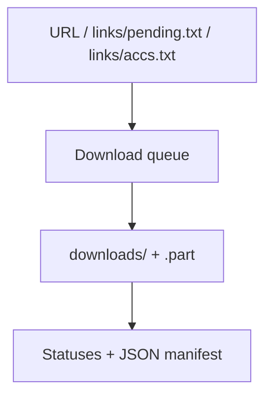

# EromeDownloader

[Русский](README.md) · [English](README_EN.md)

Консольный загрузчик публичных альбомов, медиафайлов и аккаунтов Erome. Поддерживает очереди, параллельную загрузку, докачку и отслеживание новых альбомов.

## Требования

- Python 3.14 или новее;
- интернет-доступ;
- зависимости из `requirements.txt`.

Авторизация Erome, cookies и private albums не поддерживаются.

## Быстрый старт

### Windows

[start.bat](start.bat) создаёт локальную `.venv`, устанавливает зависимости и запускает программу:

```powershell
.\start.bat
```

`pip install -r requirements.txt` выполняется при каждом запуске; уже установленные подходящие версии повторно не скачиваются.

### Ручной запуск в Windows

```powershell
python -m venv .venv
.\.venv\Scripts\python.exe -m pip install -r requirements.txt
.\.venv\Scripts\python.exe main.py
```

### Linux или macOS

```bash
python3 -m venv .venv
./.venv/bin/python -m pip install -r requirements.txt
./.venv/bin/python main.py
```

Папки `downloads/` и `links/` создаются автоматически.

## Как это работает



## Режимы

После запуска выберите один из четырёх режимов:

| Режим | Источник | Поведение |
| --- | --- | --- |
| `1` | URL из консоли | Скачивает один direct URL, альбом или все новые альбомы аккаунта |
| `2` | `links/pending.txt` | Обрабатывает очередь, повторяет failures и обновляет link status-файлы |
| `3` | `links/accs.txt` | Проверяет отслеживаемые аккаунты и скачивает новые альбомы |
| `4` | `links/accs.txt` | Только находит новые альбомы и добавляет их в `pending.txt` |

Важные различия:

- режим `1` пишет доступные данные в manifest, но не ведёт `ready.txt`, `failed.txt` и `banned.txt` как batch-очередь;
- режим `3` всегда собирает и изображения, и видео: текущая реализация не применяет к нему `skip_images` и `skip_videos`;
- режим `4` считает уже известными URL из `ready`, `banned`, `failed` и `pending`, поэтому failed URL автоматически в очередь не возвращается.

## Настройки

`config.json` содержит полный набор defaults:

```json
{
  "max_connections": 6,
  "min_connections_per_parallel_album": 3,
  "max_parallel_albums": 3,
  "auto_sort_links": true,
  "album_prefetch_connections": 6,
  "account_page_connections": 3,
  "account_max_pages": 500,
  "sort_albums_by_size": true,
  "album_size_probe_connections": 3,
  "album_size_probe_timeout": 20,
  "chunk_size_mb": 1,
  "max_attempts": 4,
  "page_attempts": 3,
  "connect_timeout": 30,
  "idle_timeout": 180,
  "skip_videos": false,
  "skip_images": false,
  "manifest_path": "links/manifest.json"
}
```

| Поле | Назначение |
| --- | --- |
| `max_connections` | Общий целевой лимит соединений загрузки |
| `min_connections_per_parallel_album` | Минимум соединений на параллельный альбом |
| `max_parallel_albums` | Максимум одновременно обрабатываемых альбомов |
| `auto_sort_links` | Сортировать очередь перед обработкой |
| `album_prefetch_connections` | Лимит параллельного чтения страниц альбомов |
| `account_page_connections` | Лимит запросов страниц аккаунта |
| `account_max_pages` | Лимит страниц одного аккаунта |
| `sort_albums_by_size` | Оценивать размер и сортировать альбомы |
| `album_size_probe_connections` | Параллельные проверки размера |
| `album_size_probe_timeout` | Тайм-аут проверки размера в секундах |
| `chunk_size_mb` | Размер записываемого chunk |
| `max_attempts` | Попытки скачивания файла |
| `page_attempts` | Попытки чтения HTML page |
| `connect_timeout` | Тайм-аут соединения в секундах |
| `idle_timeout` | Допустимое время без новых данных |
| `skip_videos` | Не включать video sources там, где режим учитывает фильтр |
| `skip_images` | Не включать images там, где режим учитывает фильтр |
| `manifest_path` | Путь к JSON manifest относительно проекта или абсолютный путь |

Если файла нет, программа создаёт его со встроенными defaults. Отсутствующие в старом файле ключи также получают встроенные значения. Типы и диапазоны пользовательских значений отдельно не валидируются, поэтому изменяйте их осторожно.

## Очереди, статусы и результаты

| Путь | Назначение |
| --- | --- |
| `links/pending.txt` | Очередь direct URLs, альбомов и аккаунтов |
| `links/accs.txt` | Постоянный список отслеживаемых аккаунтов |
| `links/ready.txt` | Успешно завершённые batch-ссылки |
| `links/failed.txt` | Ссылки, не скачанные после последней попытки |
| `links/banned.txt` | Недоступные ссылки, включая HTTP 403/404/410 |
| `links/ready_accs.txt` | Успешно обработанные аккаунты |
| `links/failed_accs.txt` | Аккаунты с ошибкой |
| `links/banned_accs.txt` | Недоступные аккаунты |
| `links/manifest.json` | Записи файлов, альбомов и аккаунтов |

Добавляйте по одному URL на строку. Пустые строки и строки, начинающиеся с `#`, игнорируются рабочими batch-режимами.

После финальной ошибки mode `2` удаляет URL из `pending.txt` и помещает его в `failed.txt`. Чтобы попробовать снова, вручную добавьте URL обратно в `pending.txt`; успешный результат перенесёт его в `ready.txt`.

## Импорт из закладок

1. Экспортируйте browser bookmarks в файл `bookmarks*.html`.
2. Положите его рядом с `main.py`.
3. Запустите:

   ```powershell
   python extract_links.py
   ```

4. Выберите файл и подтвердите операцию.

> [!WARNING]
> Текущий importer **заменяет содержимое** `links/pending.txt` найденными ссылками. Он не объединяет их с существующей очередью. Сохраните старый файл или объедините списки вручную, если очередь уже заполнена.

## Безопасность

- Проект не требует паролей, cookies или API keys.
- Direct URL не ограничен доменом Erome; используйте только доверенные ссылки.
- `downloads/`, `links/`, `.venv/` и logs исключены из Git.
- Manifest может содержать исходные URL и локальные имена файлов — учитывайте это перед публикацией.

## Ограничения

- Парсинг зависит от текущей HTML-разметки Erome: `og:title`, `<source>` и `img.img-back`.
- Resume работает только при корректной поддержке `Range` сервером; иначе файл загружается заново.
- Размер может остаться неизвестным, если сервер не сообщает его через `HEAD` или range response.

## Решение проблем

| Симптом | Что проверить |
| --- | --- |
| В очереди ничего не найдено | Формат URL и по одной ссылке на строку |
| Альбом пуст | Изменение HTML Erome или включённые `skip_*` |
| Файл постоянно начинается заново | Поддержку HTTP Range у сервера |
| URL больше не появляется после scan | Он уже есть в `ready`, `banned`, `failed` или `pending` |
| Manifest повреждён | Программа перенесёт его в файл с суффиксом `.bad` |
| Скачивание зависает | `connect_timeout`, `idle_timeout` и доступность сервера |

## Лицензия

[MIT](LICENSE).

## Поддержка

Можно [форкнуть репозиторий](https://github.com/soroka01/EromeDownloader/fork) и доработать под себя. Если проект пригодился, поставьте [Star](https://github.com/soroka01/EromeDownloader) — так я увижу, что он был кому-то полезен.

---

with love ❤️
