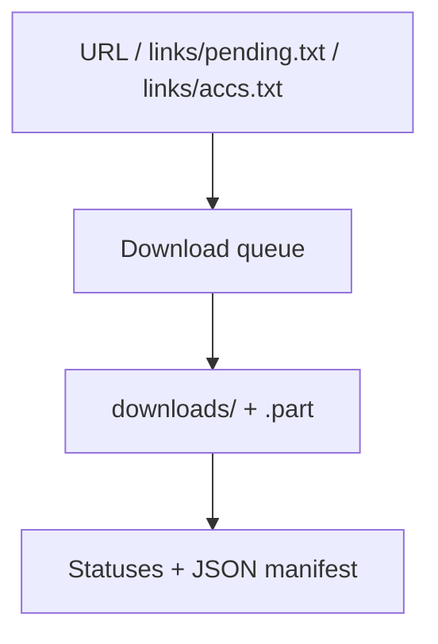

# 📥 EromeDownloader

> Консольный загрузчик публичных альбомов, медиафайлов и аккаунтов Erome.

🌐 **Язык / Language:** [Русский](README.md) · [English](README_EN.md)


## 📌 Обзор

Программа скачивает публичные альбомы, отдельные файлы и новые альбомы аккаунтов Erome. Поддерживает очереди, параллельную загрузку, докачку и отслеживание аккаунтов. Интерфейс консольный: после запуска показывается главное меню, режим выбирается номером.

> [!NOTE]
> Авторизация Erome, cookies и private albums не поддерживаются.

## ✨ Возможности

- Четыре режима: одна ссылка, очередь, проверка аккаунтов, только поиск новых альбомов
- Параллельная загрузка нескольких альбомов и файлов
- Докачка через `.part`-файлы и HTTP Range
- Отслеживание новых альбомов аккаунтов (`links/accs.txt`)
- Статус-файлы очереди и JSON manifest
- Опциональная сортировка альбомов по размеру и фильтры `skip_videos` / `skip_images`
- Импорт ссылок из браузерных закладок (`extract_links.py`)

## 🏗️ Как это работает


```mermaid
flowchart TD
    A["URL / links/pending.txt / links/accs.txt"] --> B["Download queue"]
    B --> C["downloads/ + .part"]
    C --> D["Statuses + JSON manifest"]
```

Режимы:

| Режим | Источник | Поведение |
| --- | --- | --- |
| `1` | URL из консоли | Скачивает один direct URL, альбом или все новые альбомы аккаунта |
| `2` | `links/pending.txt` | Обрабатывает очередь, повторяет failures и обновляет status-файлы |
| `3` | `links/accs.txt` | Проверяет отслеживаемые аккаунты и скачивает новые альбомы |
| `4` | `links/accs.txt` | Только находит новые альбомы и добавляет их в `pending.txt` |

- Режим `1` пишет данные в manifest, но не ведёт `ready.txt`, `failed.txt` и `banned.txt` как batch-очередь.
- Режим `3` всегда собирает и изображения, и видео: `skip_images` и `skip_videos` к нему не применяются.
- Режим `4` считает известными URL из `ready`, `banned`, `failed` и `pending`, поэтому failed URL автоматически в очередь не возвращается.

### Управление в консоли

- Главное меню: `1`–`4` — режимы из таблицы выше, `0` (или `q`, `exit`) — выход. Пустой ввод выбирает `1`. После каждого действия меню показывается снова.
- `Ctrl+C` прерывает текущее действие и возвращает в меню; `.part`-файлы и очереди сохраняются, незавершённое продолжится при следующем запуске.
- Во время работы внизу обновляется одна строка прогресса: сколько ссылок, альбомов и файлов обработано, объём, скорость и оставшееся время.
- Горячие клавиши (только в интерактивной консоли, работают и в русской раскладке): `S` — статус, `P` — пауза, `Q` — остановиться после текущего элемента. Пауза и остановка действуют между элементами: ссылками и альбомами очереди, аккаунтами; уже начатый альбом или файл дойдёт до конца. При скачивании одного альбома или файла (режим `1`) работает только `S`. Необработанное остаётся в очереди.

## 🚀 Быстрый старт

### Требования

- Python 3.14+
- Доступ в интернет
- Зависимости из `requirements.txt`

### Установка

Windows: [start.bat](start.bat) сам создаёт `.venv` и ставит зависимости (`pip install -r requirements.txt` выполняется при каждом запуске, подходящие версии повторно не скачиваются). Вручную:

```powershell
python -m venv .venv
.\.venv\Scripts\python.exe -m pip install -r requirements.txt
```

Linux / macOS:

```bash
python3 -m venv .venv
./.venv/bin/python -m pip install -r requirements.txt
```

### Конфигурация

Отдельной настройки не требуется: если `config.json` нет, он создаётся со значениями по умолчанию, а недостающие ключи добавляются встроенными значениями. Подробнее в следующем разделе.

### Запуск

```powershell
.\start.bat
```

```bash
./.venv/bin/python main.py
```

Папки `downloads/` и `links/` создаются автоматически.

## ⚙️ Конфигурация

`config.json` (значения по умолчанию):

```json
{
  "max_connections": 6,
  "min_connections_per_parallel_album": 3,
  "max_parallel_albums": 3,
  "auto_sort_links": true,
  "album_prefetch_connections": 6,
  "account_page_connections": 3,
  "account_max_pages": 500,
  "sort_albums_by_size": true,
  "album_size_probe_connections": 3,
  "album_size_probe_timeout": 20,
  "chunk_size_mb": 1,
  "max_attempts": 4,
  "page_attempts": 3,
  "connect_timeout": 30,
  "idle_timeout": 180,
  "skip_videos": false,
  "skip_images": false,
  "manifest_path": "links/manifest.json"
}
```

| Переменная | По умолчанию | Описание |
| --- | --- | --- |
| `max_connections` | `6` | Общий целевой лимит соединений загрузки |
| `min_connections_per_parallel_album` | `3` | Минимум соединений на параллельный альбом |
| `max_parallel_albums` | `3` | Максимум одновременно обрабатываемых альбомов |
| `auto_sort_links` | `true` | Сортировать очередь перед обработкой |
| `album_prefetch_connections` | `6` | Лимит параллельного чтения страниц альбомов |
| `account_page_connections` | `3` | Лимит запросов страниц аккаунта |
| `account_max_pages` | `500` | Лимит страниц одного аккаунта |
| `sort_albums_by_size` | `true` | Оценивать размер и сортировать альбомы |
| `album_size_probe_connections` | `3` | Параллельные проверки размера |
| `album_size_probe_timeout` | `20` | Тайм-аут проверки размера, секунды |
| `chunk_size_mb` | `1` | Размер записываемого chunk, МБ |
| `max_attempts` | `4` | Попытки скачивания файла |
| `page_attempts` | `3` | Попытки чтения HTML-страницы |
| `connect_timeout` | `30` | Тайм-аут соединения, секунды |
| `idle_timeout` | `180` | Допустимое время без новых данных, секунды |
| `skip_videos` | `false` | Не включать видео там, где режим учитывает фильтр |
| `skip_images` | `false` | Не включать изображения там, где режим учитывает фильтр |
| `manifest_path` | `links/manifest.json` | Путь к JSON manifest: относительно проекта или абсолютный |

Типы и диапазоны значений отдельно не валидируются — изменяйте осторожно.

### Очереди и результаты

| Путь | Назначение |
| --- | --- |
| `links/pending.txt` | Очередь direct URLs, альбомов и аккаунтов |
| `links/accs.txt` | Постоянный список отслеживаемых аккаунтов |
| `links/ready.txt` | Успешно завершённые batch-ссылки |
| `links/failed.txt` | Ссылки, не скачанные после последней попытки |
| `links/banned.txt` | Недоступные ссылки, включая HTTP 403/404/410 |
| `links/ready_accs.txt` | Успешно обработанные аккаунты |
| `links/failed_accs.txt` | Аккаунты с ошибкой |
| `links/banned_accs.txt` | Недоступные аккаунты |
| `links/manifest.json` | Записи файлов, альбомов и аккаунтов |

Один URL на строку; пустые строки и строки с `#` в начале игнорируются batch-режимами. После финальной ошибки режим `2` переносит URL из `pending.txt` в `failed.txt`; чтобы повторить, верните URL в `pending.txt` вручную.

### Импорт из закладок

1. Экспортируйте закладки браузера в `bookmarks*.html` и положите файл рядом с `main.py`.
2. Запустите `python extract_links.py`, выберите файл и подтвердите операцию.

> [!WARNING]
> Importer **заменяет содержимое** `links/pending.txt` найденными ссылками, а не объединяет их с очередью. Сохраните старый файл или объедините списки вручную.

## 🗂️ Структура проекта

```text
EromeDownloader/
├── main.py            # точка входа, меню режимов
├── extract_links.py   # импорт ссылок из закладок
├── start.bat          # лаунчер Windows (.venv + зависимости)
├── config.json        # настройки
├── requirements.txt   # зависимости
├── erome/
│   ├── config.py      # загрузка настроек
│   ├── console.py     # логи, строка прогресса, горячие клавиши
│   ├── downloader.py  # загрузка файлов
│   ├── models.py      # модели данных
│   ├── net.py         # сетевой слой
│   ├── storage.py     # очереди, статусы, manifest
│   ├── ui.py          # терминальный UI: цвета, строка статуса, ввод
│   ├── urls.py        # разбор и сортировка URL
│   └── workflow.py    # сценарии режимов 1-4
├── downloads/         # скачанные файлы (в Git не входит)
└── links/             # очереди и manifest (в Git не входит)
```

## 🔒 Безопасность и приватность

- Пароли, cookies и API keys не требуются.
- Direct URL не ограничен доменом Erome; используйте только доверенные ссылки.
- `downloads/`, `links/`, `.venv/`, `.env` и логи исключены из Git.
- Manifest может содержать исходные URL и локальные имена файлов — учитывайте это перед публикацией.

## ⚠️ Ограничения

- Парсинг зависит от текущей HTML-разметки Erome: `og:title`, `<source>` и `img.img-back`.
- Докачка работает только если сервер поддерживает `Range`; иначе файл загружается заново.
- Размер может остаться неизвестным, если сервер не сообщает его через `HEAD` или range response.
- Повреждённый manifest переносится в файл с суффиксом `.bad`.

## 📄 Лицензия

[MIT](LICENSE).

## 💬 Поддержка

Можно [форкнуть репозиторий](https://github.com/soroka01/EromeDownloader/fork) и доработать под себя. Если проект пригодился, поставьте [Star](https://github.com/soroka01/EromeDownloader) — так я увижу, что он был кому-то полезен.

---

with love ❤️
