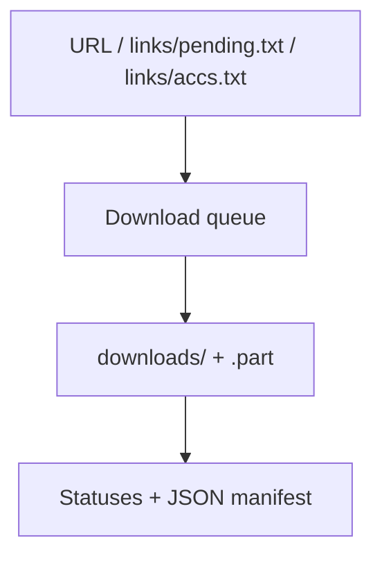

# EromeDownloader

[Русский](README.md) · [English](README_EN.md)

Command-line downloader for public Erome albums, media files, and accounts. Supports queues, parallel downloads, resuming, and tracking new albums.

## Requirements

- Python 3.14 or newer;
- internet access;
- dependencies from `requirements.txt`.

Erome authentication, cookies, and private albums are not supported.

## Quick start

### Windows launcher

[start.bat](start.bat) creates a local `.venv`, installs dependencies, and starts the program:

```powershell
.\start.bat
```

`pip install -r requirements.txt` runs on every launch; already installed compatible versions are not downloaded again.

### Manual launch on Windows

```powershell
python -m venv .venv
.\.venv\Scripts\python.exe -m pip install -r requirements.txt
.\.venv\Scripts\python.exe main.py
```

### Linux or macOS

```bash
python3 -m venv .venv
./.venv/bin/python -m pip install -r requirements.txt
./.venv/bin/python main.py
```

The `downloads/` and `links/` directories are created automatically.

## How it works



## Modes

After launch, choose one of four modes:

| Mode | Source | Behavior |
| --- | --- | --- |
| `1` | Console URL | Downloads one direct URL, one album, or all new albums from an account |
| `2` | `links/pending.txt` | Processes the queue, retries failures, and updates link status files |
| `3` | `links/accs.txt` | Checks tracked accounts and downloads new albums |
| `4` | `links/accs.txt` | Only discovers new albums and adds them to `pending.txt` |

Important differences:

- mode `1` writes available data to the manifest but does not maintain `ready.txt`, `failed.txt`, and `banned.txt` as a batch queue;
- mode `3` always collects both images and videos: the current implementation does not apply `skip_images` or `skip_videos` to it;
- mode `4` treats URLs from `ready`, `banned`, `failed`, and `pending` as already known, so a failed URL is not returned to the queue automatically.

## Configuration

`config.json` contains the complete set of defaults:

```json
{
  "max_connections": 6,
  "min_connections_per_parallel_album": 3,
  "max_parallel_albums": 3,
  "auto_sort_links": true,
  "album_prefetch_connections": 6,
  "account_page_connections": 3,
  "account_max_pages": 500,
  "sort_albums_by_size": true,
  "album_size_probe_connections": 3,
  "album_size_probe_timeout": 20,
  "chunk_size_mb": 1,
  "max_attempts": 4,
  "page_attempts": 3,
  "connect_timeout": 30,
  "idle_timeout": 180,
  "skip_videos": false,
  "skip_images": false,
  "manifest_path": "links/manifest.json"
}
```

| Field | Purpose |
| --- | --- |
| `max_connections` | Overall target limit for download connections |
| `min_connections_per_parallel_album` | Minimum connections per parallel album |
| `max_parallel_albums` | Maximum albums processed at the same time |
| `auto_sort_links` | Sort a mixed queue before processing |
| `album_prefetch_connections` | Parallel album-page read limit |
| `account_page_connections` | Account-page request limit |
| `account_max_pages` | Safety limit for pages from one account |
| `sort_albums_by_size` | Estimate sizes and sort albums |
| `album_size_probe_connections` | Parallel size probes |
| `album_size_probe_timeout` | Timeout for one size scan in seconds |
| `chunk_size_mb` | Size of each written chunk |
| `max_attempts` | File download attempts |
| `page_attempts` | HTML page read attempts |
| `connect_timeout` | Connection timeout in seconds |
| `idle_timeout` | Allowed time without new data |
| `skip_videos` | Exclude video sources in modes that apply this filter |
| `skip_images` | Exclude images in modes that apply this filter |
| `manifest_path` | JSON manifest path relative to the project, or an absolute path |

If the file is missing, the program creates it with built-in defaults. Keys missing from an older file also receive their built-in values. User-provided value types and ranges are not validated separately, so change them carefully.

## Queues, Statuses, and Manifest

| Path | Purpose |
| --- | --- |
| `links/pending.txt` | Queue of direct URLs, albums, and accounts |
| `links/accs.txt` | Persistent list of tracked accounts |
| `links/ready.txt` | Successfully completed batch links |
| `links/failed.txt` | Links not downloaded after the final retry |
| `links/banned.txt` | Unavailable links, including HTTP 403/404/410 |
| `links/ready_accs.txt` | Successfully processed accounts |
| `links/failed_accs.txt` | Accounts that encountered an error |
| `links/banned_accs.txt` | Unavailable accounts |
| `links/manifest.json` | File, album, and account records |

Add one URL per line. Empty lines and lines beginning with `#` are ignored by the working batch modes.

After a final error, mode `2` removes the URL from `pending.txt` and places it in `failed.txt`. To try again, manually add the URL back to `pending.txt`; a successful result will move it to `ready.txt`.

## Importing from Bookmarks

1. Export browser bookmarks to a `bookmarks*.html` file.
2. Put it next to `main.py`.
3. Run:

   ```powershell
   python extract_links.py
   ```

4. Select the file and confirm the operation.

> [!WARNING]
> The current importer **replaces the contents** of `links/pending.txt` with the links it finds. It does not merge them with the existing queue. Back up the old file or merge the lists manually if the queue is already populated.

## Security

- The project does not require passwords, cookies, or API keys.
- A direct URL is not restricted to the Erome domain; use trusted links only.
- `downloads/`, `links/`, `.venv/`, and logs are excluded from Git.
- The manifest may contain source URLs and local filenames; consider this before publishing it.

## Limitations

- Parsing depends on Erome's current HTML structure: `og:title`, `<source>`, and `img.img-back`.
- Resume works only when the server correctly supports `Range`; otherwise the file is downloaded again from the beginning.
- Size may remain unknown if the server does not provide it through `HEAD` or a range response.

## Troubleshooting

| Symptom | What to check |
| --- | --- |
| Nothing is found in the queue | URL format and one link per line |
| Album is empty | Erome HTML changes or enabled `skip_*` filters |
| File always restarts from the beginning | HTTP Range support on the media server |
| URL no longer appears after a scan | It is already present in `ready`, `banned`, `failed`, or `pending` |
| Manifest is corrupted | The program moves it to a file with the `.bad` suffix |
| Download stalls | `connect_timeout`, `idle_timeout`, and server availability |

## License

[MIT](LICENSE).

## Support

Feel free to [fork this repository](https://github.com/soroka01/EromeDownloader/fork) and adapt it. If it helped you, leave a [Star](https://github.com/soroka01/EromeDownloader) so I can see it was useful.

---

with love ❤️
