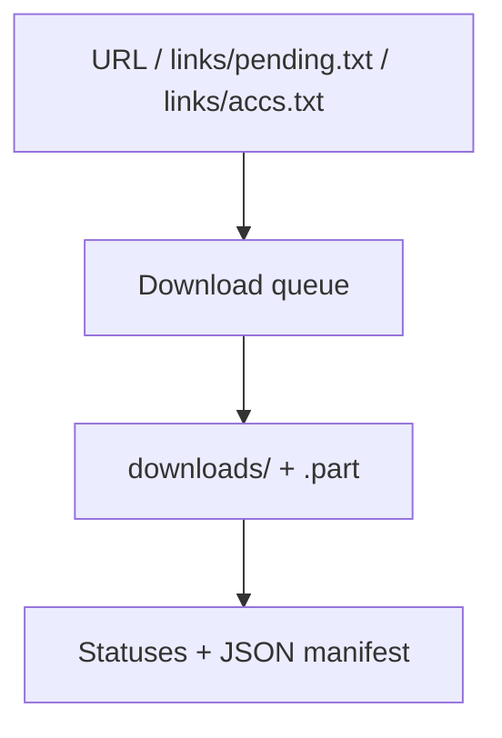

# 📥 EromeDownloader

> Command-line downloader for public Erome albums, media files and accounts.

🌐 **Язык / Language:** [Русский](README.md) · [English](README_EN.md)


## 📌 Overview

The program downloads public Erome albums, individual files and new albums from accounts. It supports queues, parallel downloads, resuming and account tracking. The interface is a console menu: after launch the main menu is shown and you pick a mode by number.

> [!NOTE]
> Erome authentication, cookies and private albums are not supported.

## ✨ Features

- Four modes: single link, queue, account check, scan-only for new albums
- Parallel downloading of multiple albums and files
- Resuming via `.part` files and HTTP Range
- Tracking new account albums (`links/accs.txt`)
- Queue status files and a JSON manifest
- Optional sorting of albums by size and `skip_videos` / `skip_images` filters
- Importing links from browser bookmarks (`extract_links.py`)

## 🏗️ How it works


```mermaid
flowchart TD
    A["URL / links/pending.txt / links/accs.txt"] --> B["Download queue"]
    B --> C["downloads/ + .part"]
    C --> D["Statuses + JSON manifest"]
```

Modes:

| Mode | Source | Behavior |
| --- | --- | --- |
| `1` | Console URL | Downloads one direct URL, one album, or all new albums of an account |
| `2` | `links/pending.txt` | Processes the queue, retries failures and updates status files |
| `3` | `links/accs.txt` | Checks tracked accounts and downloads new albums |
| `4` | `links/accs.txt` | Only finds new albums and appends them to `pending.txt` |

- Mode `1` writes to the manifest but does not maintain `ready.txt`, `failed.txt` and `banned.txt` as a batch queue.
- Mode `3` always collects both images and videos: `skip_images` and `skip_videos` are not applied to it.
- Mode `4` treats URLs from `ready`, `banned`, `failed` and `pending` as known, so a failed URL is not re-queued automatically.

### Console controls

- Main menu: `1`-`4` are the modes from the table above, `0` (or `q`, `exit`) quits. Empty input selects `1`. The menu is shown again after every action.
- `Ctrl+C` interrupts the current action and returns to the menu; `.part` files and queues are kept, so unfinished work continues on the next run.
- While running, a single progress line is updated at the bottom: links, albums and files processed, transferred size, speed and time left.
- Hot keys (interactive console only, also work on a Russian keyboard layout): `S` - status, `P` - pause, `Q` - stop after the current item. Pause and stop take effect between items: queue links and albums, accounts; an album or file already in progress runs to completion. While downloading a single album or file (mode `1`) only `S` works. Unprocessed items stay in the queue.

## 🚀 Quick start

### Requirements

- Python 3.14+
- Internet access
- Dependencies from `requirements.txt`

### Installation

Windows: [start.bat](start.bat) creates `.venv` and installs dependencies itself (`pip install -r requirements.txt` runs on every launch; compatible versions are not downloaded again). Manually:

```powershell
python -m venv .venv
.\.venv\Scripts\python.exe -m pip install -r requirements.txt
```

Linux / macOS:

```bash
python3 -m venv .venv
./.venv/bin/python -m pip install -r requirements.txt
```

### Configuration

No setup is required: if `config.json` is missing it is created with defaults, and missing keys fall back to built-in values. See the next section.

### Run

```powershell
.\start.bat
```

```bash
./.venv/bin/python main.py
```

The `downloads/` and `links/` directories are created automatically.

## ⚙️ Configuration

`config.json` (defaults):

```json
{
  "max_connections": 6,
  "min_connections_per_parallel_album": 3,
  "max_parallel_albums": 3,
  "auto_sort_links": true,
  "album_prefetch_connections": 6,
  "account_page_connections": 3,
  "account_max_pages": 500,
  "sort_albums_by_size": true,
  "album_size_probe_connections": 3,
  "album_size_probe_timeout": 20,
  "chunk_size_mb": 1,
  "max_attempts": 4,
  "page_attempts": 3,
  "connect_timeout": 30,
  "idle_timeout": 180,
  "skip_videos": false,
  "skip_images": false,
  "manifest_path": "links/manifest.json"
}
```

| Variable | Default | Description |
| --- | --- | --- |
| `max_connections` | `6` | Overall target limit of download connections |
| `min_connections_per_parallel_album` | `3` | Minimum connections per parallel album |
| `max_parallel_albums` | `3` | Maximum albums processed at once |
| `auto_sort_links` | `true` | Sort the queue before processing |
| `album_prefetch_connections` | `6` | Limit of parallel album page reads |
| `account_page_connections` | `3` | Limit of account page requests |
| `account_max_pages` | `500` | Page limit per account |
| `sort_albums_by_size` | `true` | Estimate size and sort albums |
| `album_size_probe_connections` | `3` | Parallel size probes |
| `album_size_probe_timeout` | `20` | Size probe timeout, seconds |
| `chunk_size_mb` | `1` | Size of a written chunk, MB |
| `max_attempts` | `4` | File download attempts |
| `page_attempts` | `3` | HTML page read attempts |
| `connect_timeout` | `30` | Connection timeout, seconds |
| `idle_timeout` | `180` | Allowed time without new data, seconds |
| `skip_videos` | `false` | Skip videos in modes that honor the filter |
| `skip_images` | `false` | Skip images in modes that honor the filter |
| `manifest_path` | `links/manifest.json` | JSON manifest path: project-relative or absolute |

Value types and ranges are not validated — edit with care.

### Queues and outputs

| Path | Purpose |
| --- | --- |
| `links/pending.txt` | Queue of direct URLs, albums and accounts |
| `links/accs.txt` | Persistent list of tracked accounts |
| `links/ready.txt` | Successfully completed batch links |
| `links/failed.txt` | Links that failed after the last attempt |
| `links/banned.txt` | Unavailable links, including HTTP 403/404/410 |
| `links/ready_accs.txt` | Successfully processed accounts |
| `links/failed_accs.txt` | Accounts that failed |
| `links/banned_accs.txt` | Unavailable accounts |
| `links/manifest.json` | Records of files, albums and accounts |

One URL per line; blank lines and lines starting with `#` are ignored by batch modes. After a final failure, mode `2` moves the URL from `pending.txt` to `failed.txt`; to retry, add it back to `pending.txt` manually.

### Importing bookmarks

1. Export browser bookmarks to `bookmarks*.html` and put the file next to `main.py`.
2. Run `python extract_links.py`, choose the file and confirm.

> [!WARNING]
> The importer **replaces the contents** of `links/pending.txt` with the found links instead of merging them. Back up the old file or merge lists manually.

## 🗂️ Project structure

```text
EromeDownloader/
├── main.py            # entry point, mode menu
├── extract_links.py   # bookmarks link importer
├── start.bat          # Windows launcher (.venv + dependencies)
├── config.json        # settings
├── requirements.txt   # dependencies
├── erome/
│   ├── config.py      # settings loading
│   ├── console.py     # logs, progress line, hot keys
│   ├── downloader.py  # file downloading
│   ├── models.py      # data models
│   ├── net.py         # networking
│   ├── storage.py     # queues, statuses, manifest
│   ├── ui.py          # terminal UI: colours, status line, prompts
│   ├── urls.py        # URL parsing and sorting
│   └── workflow.py    # mode 1-4 workflows
├── downloads/         # downloaded files (not in Git)
└── links/             # queues and manifest (not in Git)
```

## 🔒 Security & privacy

- No passwords, cookies or API keys are required.
- A direct URL is not restricted to the Erome domain; use trusted links only.
- `downloads/`, `links/`, `.venv/`, `.env` and logs are excluded from Git.
- The manifest may contain source URLs and local file names — consider this before sharing it.

## ⚠️ Limitations

- Parsing depends on Erome's current HTML markup: `og:title`, `<source>` and `img.img-back`.
- Resuming works only if the server supports `Range`; otherwise the file is downloaded again.
- Size may stay unknown if the server does not report it via `HEAD` or a range response.
- A corrupted manifest is moved to a file with a `.bad` suffix.

## 📄 License

[MIT](LICENSE).

## 💬 Support

Feel free to [fork the repository](https://github.com/soroka01/EromeDownloader/fork) and adapt it. If the project helped you, leave a [Star](https://github.com/soroka01/EromeDownloader) so I know it was useful.

---

with love ❤️
